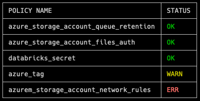
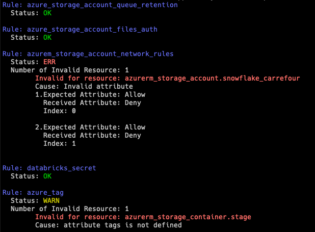

# PTF CLI

PTF was originally created to be used as a Command-Line Interface. This page describes how to use it.

To control your Terraform plan, run the command: `ptf control --plan path/to/terraform/plan.json`.
This will verify your Terraform plan against all the policies defined in the current working directory.

## Flags

`ptf control` supports the following flags:

- `-p,--plan`: Path to the Terraform plan you want to check
- `--chdir`: Directory where the policies are defined (default to current working directory)
    - To make PTF look for a specific directory, add `--chdir PATH/TO/YOUR/POLICIES`
- `--fail-on-warning`: Should PTF fails if there is at least one warning (default to False).
    - To make PTF fail if there is at least one warning, add `--fail-on-warning=true`
- `--pretty`: Should PTF displays the results in a pretty format (default to True).
    - To have the raw results, add `--pretty=false`
- `--short`: Should PTF only displays the summary of the checks (default to False).
    - To only have the summary, add `--short=true`
    - Only work in pretty mode

## Screenshots

In pretty mode, PTF displays a summary table that looks like the following:


If short mode is not activated, PTF will display information like the following:


If raw mode, is activated, PTF will output a raw json like the following:

```json
[
  {
    "name": "azure_storage_account_queue_retention",
    "is_valid": true
  },
  {
    "name": "azure_storage_account_files_auth",
    "is_valid": true
  },
  {
    "name": "azurem_storage_account_network_rules",
    "is_valid": false,
    "severity": "error",
    "invalid_resources": [
      {
        "address": "azurerm_storage_account.storage_account_example",
        "attribute_name": "network_rules.[*].default_action",
        "error_message": "Invalid attribute",
        "invalid_attributes": [
          {
            "expected_attribute": "Allow",
            "received_attribute": "Deny"
          },
          {
            "expected_attribute": "Allow",
            "received_attribute": "Deny"
          }
        ]
      }
    ]
  },
  {
    "name": "databricks_secret",
    "is_valid": true
  },
  {
    "name": "azure_tag",
    "is_valid": false,
    "severity": "warning",
    "invalid_resources": [
      {
        "address": "azurerm_storage_container.storage_container_1",
        "attribute_name": "tags",
        "error_message": "attribute tags is not defined",
        "invalid_attributes": null
      }
    ]
  }
]
```
